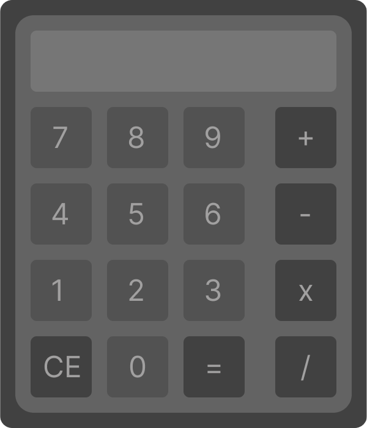

# Basic Calculator (Python + CustomTkinter)
Basic calculator built with Python and CustomTkinter and UI designed in Figma

## Features
- Basic arithmetic opeations (addition, subtraction, multiplication, division)
- Clean graphical interface

## UI Desing
The interface was designed in Figma before implementation.

## Preview

## Technologies
- Python 3
- CustomTkinter
- Figma (UI desing)

## Proyect Status
Working initial version. Improvements and refactoring will be added over time.

## Future Improvements
- Improve code structure
- Enhance UI